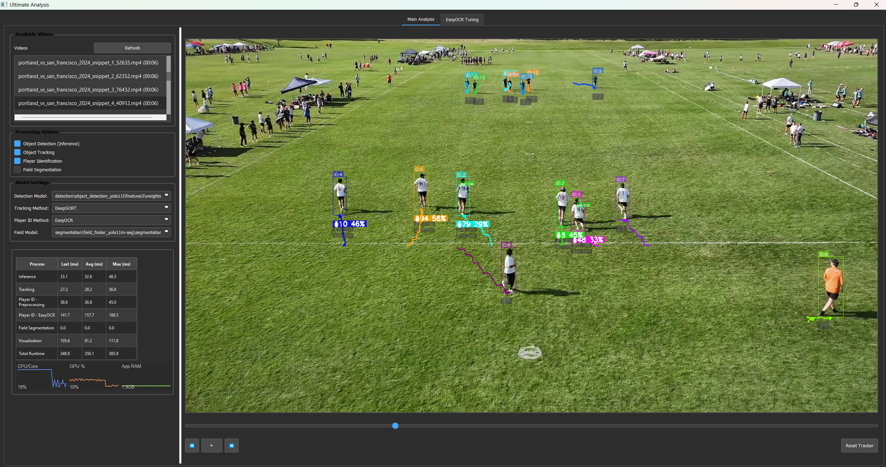

# Ultimate Analysis

A PyQt5-based video analysis application designed for Ultimate Frisbee game analysis with advanced computer vision, real-time player tracking, and intelligent jersey number identification.

## Features

### Core Analysis Capabilities
- **Advanced Object Detection**: Custom-trained YOLO11 models for Ultimate Frisbee-specific detection (players, disc)
- **Multi-Object Tracking**: Real-time player tracking with persistent ID assignment and trajectory visualization
- **Intelligent Player Identification**: Advanced jersey number recognition with historical filtering and probability-based estimation
- **Field Segmentation**: Automated field boundary detection with custom-trained segmentation models
- **Performance Monitoring**: Comprehensive runtime analysis with detailed timing breakdowns and memory usage tracking

### Jersey Number Recognition System
- **Dual-Method Detection**: Combined YOLO detection + EasyOCR for robust number recognition
- **Historical Filtering**: Conservative weighted-average algorithm with probability normalization
- **Position-Based Weighting**: Confidence adjustment based on text position within player bounding boxes
- **Time-Decay Filtering**: Exponential time decay with configurable history length (default 30 measurements, 10-second window)
- **Confidence Thresholds**: Minimum probability (40%) and measurement count (2) requirements for stable assignment
- **Top-3 Display**: Always shows top 3 jersey number candidates with probabilities, uses "??" for unknown

### Enhanced Visualization
- **Multi-Layer Overlays**: Separate visualization layers for detection, tracking, player IDs, and field boundaries
- **Opacity-Controlled Elements**: Configurable transparency for all visual elements to reduce clutter
- **Compact Jersey Display**: Clean, hierarchical display showing main estimate prominently with subtle alternatives
- **Performance Metrics**: Real-time FPS, processing times, and resource usage displayed in GUI
- **Interactive Controls**: Keyboard shortcuts for all major functions (play/pause, reset, toggle features)

### Processing Pipeline
- **Optimized Inference**: Model caching, batch processing, and frame skipping for real-time performance
- **Parallel Processing**: Multi-threaded architecture for detection, tracking, and player ID operations
- **Memory Management**: Automatic cleanup of old tracks and cached results
- **Configurable Parameters**: YAML-based configuration for all processing parameters and thresholds

## System Requirements

- Python 3.8 or higher
- CUDA-compatible GPU (recommended for optimal performance)
- 8GB RAM minimum, 16GB recommended
- 2GB available disk space for models and cache

## Quick Start

### Installation

1. **Clone the repository**:
   ```bash
   git clone <repository-url>
   cd ultimate-analysis
   ```

2. **Create virtual environment**:
   ```bash
   python -m venv venv
   source venv/bin/activate  # On Windows: venv\Scripts\activate
   ```

3. **Install dependencies**:
   ```bash
   pip install -e .
   ```

4. **Set up environment**:
   ```bash
   python scripts/setup_environment.py
   ```

### Basic Usage

1. **Run the application**:
   ```bash
   python run_app.py
   ```

2. **Load a video**: Click "Browse Videos" to select from available test videos in `data/processed/dev_data/`
3. **Configure detection models**: 
   - Select YOLO detection model (recommended: `yolo11l.pt`)
   - Adjust confidence and NMS thresholds as needed
4. **Configure player identification**:
   - Enable EasyOCR jersey number detection
   - Tune EasyOCR parameters (confidence, text detection thresholds)
   - Configure filtering settings (history length, time window)
5. **Start analysis**: Click play to begin real-time analysis with all features enabled

### Key Controls

- **Space**: Play/Pause video
- **I**: Toggle object detection inference
- **T**: Toggle object tracking
- **J**: Toggle jersey number identification
- **F**: Toggle field segmentation
- **R**: Reset all trackers
- **Left/Right**: Navigate between videos

## Application Interface



*The Ultimate Analysis interface showing real-time video analysis with player tracking, jersey number identification, and performance monitoring. The application displays detection bounding boxes, track IDs, jersey number probabilities, and comprehensive timing metrics.*

## Project Structure

```
ultimate-analysis/
├── src/ultimate_analysis/      # Main application source
│   ├── config/                 # Configuration management
│   ├── core/                   # Core utilities and exceptions
│   ├── gui/                    # PyQt5 interface components
│   ├── processing/             # ML inference and video processing
│   └── utils/                  # Utility functions
├── configs/                    # Configuration files
├── data/                       # Data directories (gitignored)
│   ├── models/                 # Trained models
│   ├── raw/                    # Raw input data
│   └── processed/              # Processed datasets
├── docs/                       # Documentation
├── scripts/                    # Setup and utility scripts
└── tests/                      # Test suite
```

## Configuration

The application uses YAML configuration files located in `configs/`:

- `default.yaml`: Base configuration
- `development.yaml`: Development-specific overrides
- `production.yaml`: Production settings

Set the environment with:
```bash
export ULTIMATE_ANALYSIS_ENV=development  # or production
```

## Development

### Development Setup

1. **Install development dependencies**:
   ```bash
   pip install -e ".[dev]"
   ```

2. **Run tests**:
   ```bash
   pytest
   ```

3. **Code formatting**:
   ```bash
   black src/ tests/
   flake8 src/ tests/
   ```

### Development Guidelines

- Follow the **KISS principle**: Keep implementations simple and focused
- **File size limit**: Maximum 500 lines per file
- **Type hints**: Required for all function signatures
- **Documentation**: Docstrings for all public functions and classes
- **Testing**: Write tests for new functionality

See `docs/DEVELOPMENT_GUIDELINES.md` for complete development standards.

### Key Development Principles

1. **Separation of Concerns**: GUI, processing, and utilities are separate
2. **Performance First**: Optimize for real-time video processing
3. **Modularity**: Easy addition of new features
4. **Error Handling**: Graceful degradation and meaningful error messages

## Models

The application uses custom-trained YOLO models optimized for Ultimate Frisbee analysis:

### Detection Models
- **Primary**: `data/models/detection/object_detection_yolo11l/finetune3/weights/best.pt`
- **Fallback**: `data/models/pretrained/yolo11l.pt`
- **Classes**: Players (class 1), Disc (class 0)

### Segmentation Models  
- **Field Detection**: `data/models/segmentation/field_finder_yolo11x-seg/` (multiple training runs available)
- **Fallback**: `data/models/pretrained/yolo11l-seg.pt`

### Player Identification
- **Text Detection**: EasyOCR engine with configurable parameters
- **Jersey Number Range**: 0-99 (configurable in constants)
- **Filtering Algorithm**: Conservative Historical Weighted Average with Probability Normalization

### Model Management
- Models are automatically discovered from directory structure
- Supports both custom-trained and pretrained YOLO models
- Model caching for improved performance
- Configurable model selection per processing type

## Jersey Number Filtering Algorithm

The application uses a **Conservative Historical Weighted Average with Probability Normalization** algorithm designed specifically for jersey number identification:

### Algorithm Components

1. **Measurement Collection**: Each EasyOCR detection creates a measurement with:
   - Jersey number string and confidence score
   - Position-based weighting (horizontal centrality preferred)
   - Timestamp for time-decay calculations

2. **Historical Tracking**: Maintains rolling history per track:
   - Up to 30 measurements per track (configurable)
   - 10-second time window (configurable)
   - Automatic cleanup of expired measurements

3. **Confidence Calculation**: Conservative weighted average using:
   - **Time Decay**: Exponential decay over measurement age
   - **Consistency Multiplier**: Exponential boost for established numbers (5+ measurements = 1.5x)
   - **Stability Boost**: Higher confidence for consistent measurements (lower std deviation)

4. **Probability Normalization**: Converts raw confidences to probabilities:
   - All jersey number probabilities sum to 1.0
   - Ensures mathematical correctness for uncertainty quantification

5. **Filtering Thresholds**: Conservative assignment criteria:
   - Minimum 40% probability required
   - Minimum 2 measurements for stability
   - High inertia design (jersey numbers don't change during games)

### Design Philosophy
- **Conservative Approach**: Heavily favors historical consensus over single measurements
- **High Inertia**: Jersey numbers are static, so algorithm resists rapid changes
- **Position Awareness**: Text detections near center of player boxes weighted higher
- **Temporal Consistency**: Recent measurements decay gracefully, maintaining long-term memory

## Configuration

### Jersey Number Filtering Settings
```yaml
player_id:
  filter:
    max_history_length: 30        # Maximum measurements per track
    max_age_seconds: 10.0         # Time window for measurements
    min_probability_threshold: 0.4 # Minimum probability for assignment
    min_measurement_count: 2       # Minimum measurements for stability
```

### EasyOCR Parameters
```yaml
player_id:
  easyocr:
    confidence_threshold: 0.3     # Text detection confidence
    width_threshold: 0.7          # Text box width filtering
    height_threshold: 0.7         # Text box height filtering
    text_threshold: 0.7           # Text recognition threshold
    low_text: 0.4                 # Low confidence text detection
    link_threshold: 0.4           # Text linking threshold
    canvas_size: 2560             # Processing canvas size
    mag_ratio: 1.5                # Magnification ratio
```

## Performance

### Real-Time Processing Capabilities
- **Video Processing**: 25-30 FPS on modern hardware with GPU acceleration
- **Detection Inference**: ~20-40ms per frame (depends on model size and GPU)
- **Player Tracking**: ~5-10ms per frame with up to 20+ simultaneous tracks
- **Jersey Number Recognition**: ~10-20ms per detection with EasyOCR
- **Jersey Number Filtering**: <1ms per track (cached probability calculations)

### Performance Monitoring
The application provides detailed performance metrics:
- **Per-Component Timing**: Separate measurements for detection, tracking, player ID, filtering
- **Memory Usage**: Track memory consumption and automatic cleanup
- **FPS Monitoring**: Real-time frame rate display
- **Processing Load**: Visualization of computational bottlenecks

### Optimization Features
- **Model Caching**: Models loaded once and cached for reuse
- **Result Caching**: Jersey number estimates cached for 100ms
- **Frame Skipping**: Configurable processing frequency (`video.frame_skip`)
- **Batch Processing**: Optimized batch operations for player ID
- **Memory Management**: Automatic cleanup of inactive tracks and old measurements

### Hardware Recommendations
- **GPU**: CUDA-compatible GPU with 4GB+ VRAM (RTX 3060 or better)
- **CPU**: Modern multi-core processor (Intel i5/AMD Ryzen 5 or better)
- **RAM**: 16GB+ for optimal performance with large videos
- **Storage**: SSD recommended for model loading and video I/O

## Troubleshooting

### Common Issues

**Jersey numbers not being detected**:
- Check EasyOCR confidence thresholds (try lowering to 0.2-0.3)
- Verify jersey area visibility in player bounding boxes
- Ensure sufficient lighting and resolution for text recognition
- Check that jersey numbers are within 0-99 range

**Jersey number assignments unstable**:
- Increase minimum measurement count (default: 2)
- Adjust probability threshold (default: 0.4)
- Extend history length for more conservative filtering
- Check for tracking ID switches causing history resets

**Models not loading**:
- Ensure models are in correct `data/models/` directory structure
- Check model file permissions and integrity
- Verify CUDA installation for GPU models
- Check available GPU memory for large models

**Poor detection performance**:
- Reduce video resolution or frame skip setting
- Use smaller YOLO models (yolo11n vs yolo11l vs yolo11x)
- Adjust confidence and NMS thresholds
- Close other GPU-intensive applications

**GUI freezing or slow response**:
- Reduce visualization complexity (disable EasyOCR debug boxes)
- Lower frame processing rate
- Check memory usage and enable garbage collection
- Ensure processing runs in background threads

**High memory usage**:
- Reduce track history length settings
- Enable automatic cleanup of old tracks
- Lower EasyOCR canvas size parameter
- Clear cache periodically during long sessions

### Logging

Logs are written to `logs/ultimate_analysis.log` by default. Adjust log level in configuration:

```yaml
app:
  log_level: "DEBUG"  # DEBUG, INFO, WARNING, ERROR
```

## Contributing

1. Fork the repository
2. Create a feature branch
3. Follow development guidelines
4. Add tests for new functionality
5. Submit a pull request

## License

This project is licensed under the GNU General Public License v3.0 - see the [LICENSE](docs/LICENSE) file for details.

## Support

For issues and questions:
- Check the troubleshooting section
- Review existing issues on GitHub
- Create a new issue with detailed information

---

**Ultimate Analysis v2.0** - Advanced computer vision for Ultimate Frisbee analysis with intelligent player identification and real-time performance monitoring.

**Key Features**: Custom YOLO11 models, probabilistic jersey number filtering, multi-object tracking, field segmentation, comprehensive performance analytics.
