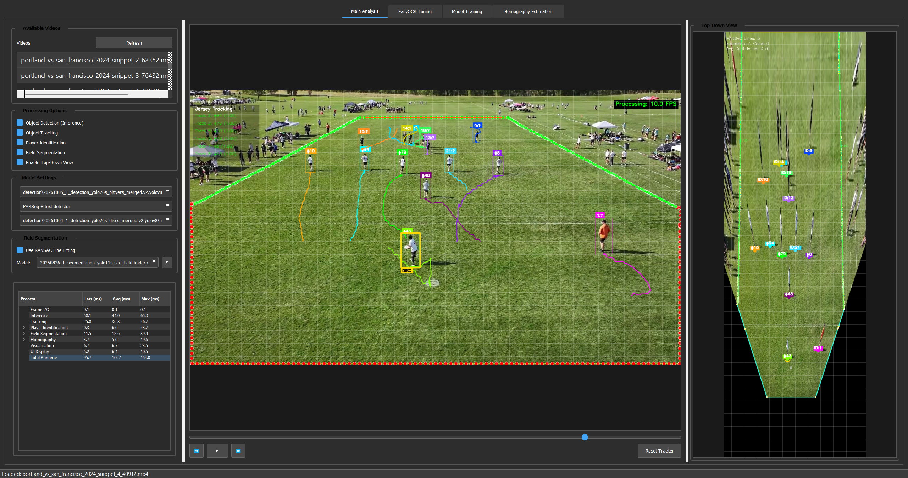
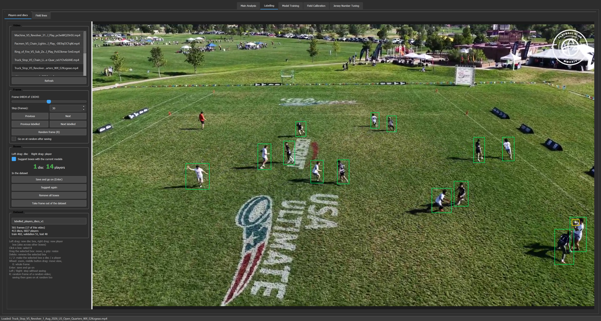
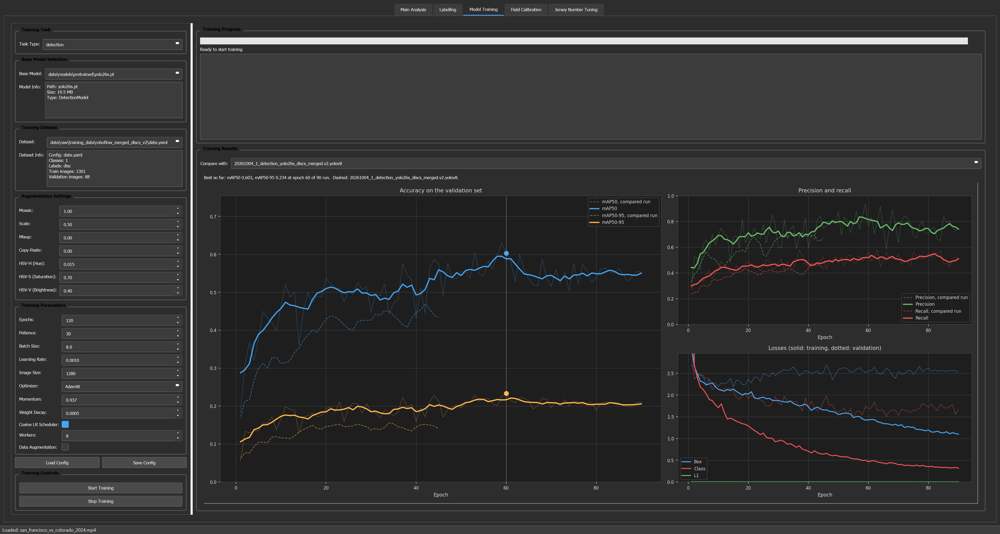
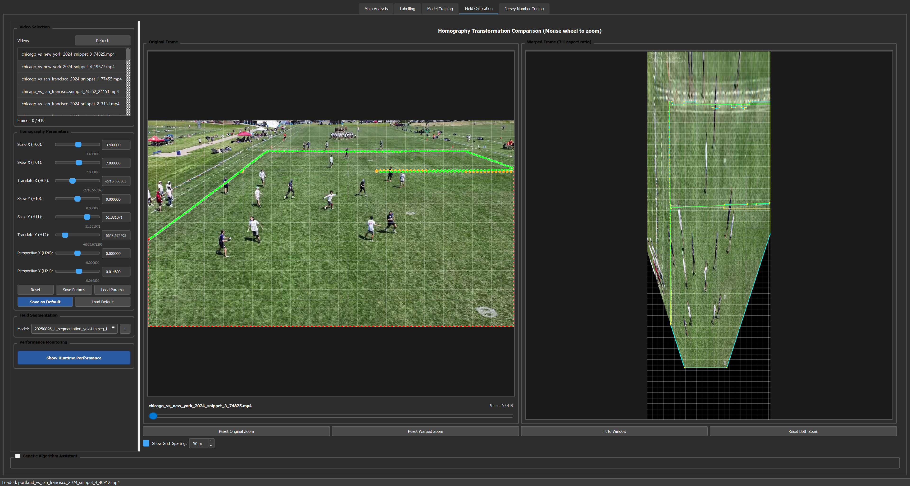
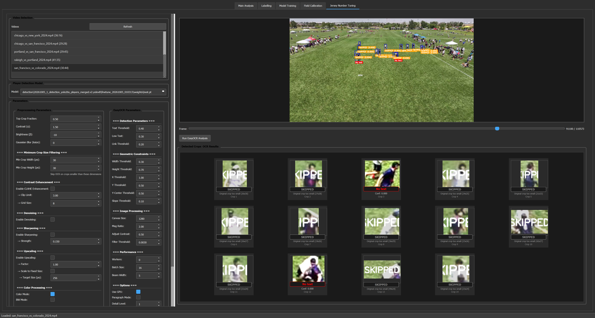

# Ultimate Analysis

A PyQt5 desktop application for analysing Ultimate Frisbee video with YOLO detection,
DeepSORT tracking, OCR-based player identification, and a top-down field view.

## Features

- **Object detection**: players and discs, with separately selectable models.
- **Tracking**: consistent player and disc identities across frames (DeepSORT), with
  trails and foot-level positions.
- **Possession**: the player holding the disc is highlighted in both views.
- **Player identification**: jersey numbers read by a selectable reader (PARSeq,
  Florence-2, a YOLO digit detector, or EasyOCR) and aggregated over time, plus a tuning
  tab for the EasyOCR and crop-preprocessing parameters.
- **Field segmentation**: field mask, contour, and RANSAC boundary lines.
- **Field calibration**: interactive perspective correction with a genetic-algorithm
  assistant; the result drives the top-down view in the main tab.
- **Model training**: train YOLO11/YOLO26 detection and segmentation models from the
  GUI with live output, progress, and metric plots against a baseline.
- **Labelling**: mark players and discs on frames of your videos, starting from what the
  current models find, and train on the result without leaving the app.
- **Performance monitoring**: per-stage timings while analysis runs.

## Screenshots

**Main Analysis** — detection, tracking, jersey numbers, the disc holder (gold box), the
field outline, and the top-down view:



**Labelling** — correcting the models' suggestions to build a training dataset:



**Model Training** — live output and metric plots:



**Field Calibration** — manual calibration and the genetic-algorithm assistant:



**Jersey Number Tuning** — crop preprocessing and reader parameters on single frames:



## Pipeline

Each frame of the Main Analysis tab goes through these stages, every one of which can be
switched off:

1. **Detection** — one YOLO26s model for players and one for discs, both at image size
   1280 and run as TensorRT engines when built. The disc model is skipped while no disc
   has been seen for a while.
2. **Tracking** — DeepSORT gives players and the disc stable IDs and trails. A player who
   is not detected is remembered for three seconds. The camera's own motion is estimated
   from the background and taken out of the trails and of the tracker's expectations, so
   a pan does not look like every player jumping.
3. **Possession** — the player whose box holds the detected disc, confirmed over several
   frames.
4. **Jersey numbers** — a few tracks per frame are read (PARSeq by default) and the
   readings are accumulated per track.
5. **Field segmentation** — every fifth frame: field mask, outline, and RANSAC boundary
   lines.
6. **Rendering** — overlays on the camera view, and the frame warped to the top-down view
   with players mapped by their foot positions.

The pipeline runs on a worker thread at about 20 frames per second on an RTX 5060 Ti with
all stages on, and the window stays responsive meanwhile.

## Quick Start

Requirements: Python 3.12 (the version it is developed on), a CUDA-capable GPU
(recommended), 8 GB RAM.

```bash
git clone <repository-url>
cd ultimate-analysis
python -m venv .venv
.venv\Scripts\activate  # Windows
python -m pip install -r requirements.txt
python main.py
```

1. Put videos in `data/raw/videos` and select one in the Main Analysis tab.
2. Choose the player, disc, and field-segmentation models.
3. Press play. Toggle detection, tracking, player ID, segmentation, and the top-down
   view independently.
4. Use the Field Calibration tab to calibrate the top-down view, and the Jersey Number Tuning and
   Model Training tabs for the specialist workflows.

## Configuration

Configuration files are in `configs/`:

- `default.yaml` — application, model, tracking, segmentation, and homography settings
- `easyocr_params.yaml` — EasyOCR and crop-preprocessing parameters
- `training.yaml` — training defaults (model, dataset, epochs, image size, ...)
- `homography_params.yaml` — the saved default perspective transform

## Models and Data

Everything under `data/` is local and not tracked by Git.

- `data/models/pretrained/` — base weights; missing YOLO11/YOLO26 weights download
  automatically when selected for training.
- `data/models/detection/`, `data/models/segmentation/` — one folder per training run.
  The model dropdowns list each run's `weights/best.pt`.
- `data/raw/training_data/` — datasets in YOLO format, named
  `<origin>_<content>_<version>`. The origin says who made the labels and how far the
  folder can be trusted as a source:

  | Folder | What it is | Used for |
  | --- | --- | --- |
  | `labelled_players_discs_v1` | Frames labelled in the Labelling tab, full resolution | Future training |
  | `labelled_discs_v1` | Frames labelled from the phone, discs only, full resolution | Future training |
  | `combined_discs_v1` | `roboflow_merged_discs_v2` plus the disc boxes of both `labelled_` sets, built by `scripts/build_combined_disc_dataset.py` | Trial retraining of the disc model |
  | `roboflow_merged_players_v2` | Built from the Roboflow exports: 1,442 images at 1280×720, players only | The default player model, benchmarks |
  | `roboflow_merged_discs_v2` | The same images, discs only | The default disc model, benchmarks |
  | `roboflow_object_detection_v3i` | Roboflow export as downloaded: players and discs, 960×960 | Source of the merged sets |
  | `roboflow_player_disc_detection_v4i` | Roboflow export: players and discs of one game, stretched to 1280×1280 | Source of the merged sets |
  | `roboflow_object_detection_disc_v1i` | Roboflow export: discs only, 1920×1080 | Source of the merged sets |
  | `roboflow_field_finder_v8i` | Roboflow export: field and end zones, stretched to a square | The field segmentation model |
  | `roboflow_digits_v1i` | Roboflow export: house-number digits | A rough start for a jersey digit detector |

  `labelled_` is labelled with this app, `roboflow_` is a Roboflow export exactly as
  downloaded, and `roboflow_merged_` is built from those exports by
  `scripts/build_merged_detection_dataset.py` (1280×720, 16:9 restored) and
  `scripts/build_single_class_dataset.py` (the labels of one class only). The version
  counts up within one name; Roboflow's own version numbers end in `i`. The folders of
  training runs made before the renaming still end in the old dataset names.

## Labelling

The Labelling tab builds a dataset from your own videos at full resolution.

1. Pick a video and a frame. The boxes the current default models find are shown dashed,
   as suggestions.
2. Correct them: drag a box to move it, drag a grip to resize it, press Delete to remove
   it, and drag on free space to draw a new one (press 1 for a disc, 2 for a player
   first). Zoom in with the mouse wheel for the disc.
3. Press Enter to save the frame and move on by the step size. Left and Right step
   without saving, so frames you skip do not end up in the dataset.

Saved frames go to `data/raw/training_data/<dataset name>` as images and YOLO labels,
named after the video and frame number. Each stretch of 300 frames belongs as a whole to
training, validation (one in ten), or testing (one in ten), so near-identical frames never
land on both sides. The dataset is listed in the Model Training tab as soon as it has
frames.

### Labelling discs from a phone

`python scripts/phone_labelling.py` starts a small web server on this PC and prints an
address to open in the phone's browser. The page shows one frame of a game at a time:

- "Is this the disc?" with the disc model's suggestion: Yes, No, or move the box.
- Without a suggestion, or after No: tap the disc on the frame, tap it again on a closer
  view, drag the box onto it. Or "No disc visible", which stores the frame as an example
  of what is not a disc.

Frames come from all games in `data/raw/videos`, favouring those the model is unsure
about. Answers go to the disc-only dataset `labelled_discs_v1`, at full resolution
and with the same file layout as the Labelling tab. The PC has to stay on.

The address contains a key, kept in `data/cache/phone_labelling.key`; requests without
it are refused. On the home network the printed address works as it is (allow Python
through the Windows firewall for private networks when asked). From anywhere else, install
Tailscale on the PC and the phone and sign in with the same account; the script then
prints a second address that works over that private link. Do not forward the port on
your router.

## Development

See `docs/DEVELOPMENT_GUIDELINES.md` for layout and conventions, and
`docs/REBUILD_DESIGN_DOCUMENT.md` for a description of what each tab does.

```bash
python -m pip install -r requirements-dev.txt
python -m ruff check src tests scripts
python -m ruff format --check src tests scripts
python -m unittest discover -s tests -v
```

The tests use synthetic frames and mocked models, so they need no videos or weights.

The code under `src/ultimate_analysis/` is layered: `processing/` holds the analysis
stages, `rendering/` draws their results with OpenCV, `pipeline.py` combines both into
one call per frame, and `gui/` holds everything Qt, with one package per tab. The Main
Analysis tab runs the pipeline on a worker thread, so the window stays responsive while
a frame is processed.

Behaviour worth knowing when changing the pipeline:

- Redraws of the current frame reuse its processing results. Seeking or switching
  videos clears tracking, OCR identities, and cached segmentation.
- Field segmentation runs every few frames; the mask, contour, and line fit are
  cached until the next run.
- Selecting the same model for players and discs runs it once per frame and splits its
  detections by class. A model only reports the classes it is selected for.
- Possession goes to the player whose box contains the detected disc. The holder only
  changes after the disc has been seen at another player, or at no player, for
  `models.possession.confirm_frames` frames in a row (10), so a disc flying past someone
  does not change it. Frames without a detected disc leave the holder as it is.
- The disc model is skipped after a stretch with no disc and retried periodically
  (`models.disc_detection.skip_threshold`: 30 frames; `retry_interval`: 5 frames).

### Detection models

Players and discs are detected by two separate models (the defaults in
`configs/default.yaml`). A dedicated disc model finds clearly more discs than one model
trained on both classes; for players it makes no difference. Selecting the same model in
both roles runs it once per frame instead of twice.

`scripts/benchmark_detectors.py` scores models on the validation and test images of the
default training dataset (141 images with 1,981 players and 98 discs) and times them on
video frames. A detection counts when it overlaps a labelled box of its class with
IoU ≥ 0.5; recall is at the app's confidence threshold (players 0.5, discs 0.3). All
models below were trained on the `roboflow_merged_*_v2` data; times are with TensorRT engines unless
noted.

| Model | Player AP50 | Player recall | Disc AP50 | Disc recall | Time per frame |
| --- | --- | --- | --- | --- | --- |
| YOLO26s at 1280, players only (default player model) | 0.982 | 0.977 | | | 6.5 ms |
| YOLO26s at 1280, discs only (default disc model) | | | 0.505 | 0.449 | 5.3 ms |
| YOLO26s at 1280, both classes | 0.980 | 0.976 | 0.384 | 0.296 | 5.4 ms |
| YOLO26s-P2 at 1280, discs only (extra head for small objects) | | | 0.531 | 0.357 | 5.8 ms |
| RT-DETR-L at 960, both classes | 0.977 | 0.970 | 0.280 | 0.316 | 30.5 ms (PyTorch) |

The previous defaults (YOLO11s trained on the older, smaller datasets) scored 0.853 AP50
for players and 0.324 for discs.

A disc is about 11 pixels wide in a 1280×720 frame, so it needs the full image size and
is still the weak spot: the best model finds less than half of the discs.

A trial with the frames labelled in this app: `scripts/build_combined_disc_dataset.py`
adds them to the Roboflow disc data (`combined_discs_v1`: 166 of the 1,467 training
images and 127 of the 982 training discs are own labels), and YOLO26s was trained on it
with the settings of the default disc model.

| Scored on | Discs | Default disc model: AP50 / recall | Trained on the combined data: AP50 / recall |
| --- | --- | --- | --- |
| Old validation and test images (as the table above) | 98 | 0.505 / 0.449 | 0.559 / 0.449 |
| Old test images only | 44 | 0.522 / 0.432 | 0.588 / 0.432 |
| Own labels, validation and test | 49 | 0.629 / 0.551 | 0.640 / 0.551 |
| Own labels, test only | 25 | 0.664 / 0.640 | 0.654 / 0.560 |

AP50 rises a little on the old images, and the number of discs found at the app's
threshold stays the same; with this few discs neither is more than a hint. The default
model was not changed.

To train a detector for one class, build a single-class copy of a dataset with
`scripts/build_single_class_dataset.py` and select it in the Model Training tab.

The tab also lists RT-DETR (`rtdetr-l.pt`, `rtdetr-x.pt`), a transformer detector, as an
alternative to YOLO. It stretches the frame to a square and runs in PyTorch only. On this
data it matched YOLO for players, was worse for discs (a quarter of its disc detections
at the app's threshold were right), and took twice as long to train.

### Camera motion

The motion of the picture between frames is estimated from background points followed
with optical flow (players masked out) and fitted as a homography. Compared on stretches
of a game where the camera pans, by how well the previous frame moved by the estimate
matches the current one on the background (mean grey difference, lower is better):

| Estimator | After 1 frame | After 30 frames | Time per frame |
| --- | --- | --- | --- |
| None | 9.0 | 15.8 | |
| Phase correlation (shift only) | 10.7 | 19.1 | 10 ms |
| ORB feature matching, homography | 7.7 | 16.5 | 27 ms |
| Optical flow, similarity (shift, zoom, roll) | 7.3 | 18.3 | 13 ms |
| Dense Farneback flow, homography | 3.7 | 12.4 | 22 ms |
| Optical flow, homography, frame to frame | 3.3 | 10.6 | 7 ms |
| Optical flow, homography, same points followed for 30 frames (used) | 3.5 | 8.1 | 4 ms |

Times were taken while a training run used the machine and are only comparable with each
other. `models.tracking.camera_motion_compensation: false` switches the stage off.

### Tracking and player identities

Measured on a 45-second uncut stretch with about 15 players on screen, by how many player
IDs the tracker hands out (fewer is better; players walking into the picture also get
new IDs, so the count never reaches the number of players):

| | Player IDs | Tracks lasting most of the stretch |
| --- | --- | --- |
| Track memory of 30 frames (0.5 s at 60 fps) | 32 | 7 |
| Track memory of 3 s, camera motion given to the tracker | 21 | 12 |

Fast pans still break tracks: a 22-second stretch with the fastest camera motion gave 41
IDs for 14 players.

Recognising a lost player again by looks does not work on this footage. Players are about
90 pixels tall and teammates wear the same kit: a network trained to re-identify people
(OSNet) picked the right one of 16 players in 24% of cases, the tracker's own appearance
vector in 13%. Matching a new track to a missing player by where that player could have
run to (`models.tracking.identity.position_match_seconds`) recovered nobody on three
test stretches and joined two different players once, so it is off. What remains is the
jersey number: a player whose number is that of a missing player in the same kit becomes
that player again.

Jersey numbers are decided by vote over all readings of a player. A number is shown from
the second reading on, and its certainty grows with agreement; a single reading never
makes a number final.

### Field segmentation

The field lines are fitted to the outline of the predicted field. `scripts/benchmark_segmentation.py`
scores the segmentation model on its validation and test images (48): IoU of the whole
field and of each class, and the average distance between the predicted and the labelled
field outline in pixels of a 1920×1080 frame.

| | Field IoU | Central field IoU | End zone IoU | Outline error |
| --- | --- | --- | --- | --- |
| Default model (YOLO11s-seg) | 0.995 | 0.991 | 0.957 | 2.5 px |

The training images are 16:9 frames stretched to a square, so the app stretches each frame
the same way before segmenting it. Padding the frame to a square instead, as the app did
before, gave 0.983 field IoU, 0.892 for the end zones, and a 14 px outline error.

These labelled images are easy ones from the short clips; the full games are harder. On
200 random frames of the five games, a confidence threshold of 0.6 cut a part of the field
away (mostly the far end zone) in 38 frames, and 0.4 in 17; the scores above are the same
for both. The model has not been trained on the low side-line camera of
`raleigh_vs_portland_2024` and finds no usable field in about a quarter of its frames.

The line fit (RANSAC on the field outline) gives the same lines for the same mask, and
stops when what is left of the outline is shorter than a field line. Measured on 79 masks
from the games:

| | Outline explained | Difference between two runs | Junk lines | Time |
| --- | --- | --- | --- | --- |
| Before (20 random pairs per line, always 4 lines) | 96.2% | 2.0 px (worst tenth 5.5 px) | 6.6% | 4.8 ms |
| Now (100 pairs at once, fixed seed, refined fit) | 96.7% | 0 px | 5.7% | 5.6 ms |

### Jersey number readers

The reader is chosen with "Jersey Number Reader" in the Main Analysis tab or
`models.player_id.method`. Measured on 1,016 hand-labelled crops of 23 players from four
games, plus crops of 14 players with no visible number:

| Reader | Players identified | Wrong | Correct / wrong reads per crop | Time per crop |
| --- | --- | --- | --- | --- |
| `parseq` (default) | 17 of 23 | 0 | 18.9% / 0.3% | 8 ms |
| `florence` | 19 of 23 | 1 | 21.3% / 1.6% | 38 ms |
| `easyocr` | 11 of 23 | 4 | 7.6% / 3.7% | 9 ms |
| `yolo_digits` | not measured: no digit model trained yet | | | |

Most crops show a player from the front or side, so a low per-crop rate is expected; what
counts is that the reads that do come are right. None of the readers reported a number
for the players without one.

- `parseq` runs the PARSeq recognizer on the regions EasyOCR's text detector finds. It is
  downloaded through `torch.hub` on first use.
- `florence` is the Florence-2 vision-language model. It answers for every crop, so reads
  below `models.player_id.florence.min_confidence` (0.7) are discarded.
- `yolo_digits` uses the newest detection run trained on a dataset with "digits" in its
  name (train one in the Model Training tab; `roboflow_digits_v1i` is house numbers, a rough
  starting point). Until one exists the app falls back to EasyOCR, as it does for any
  reader that fails to load.

### Jersey reading schedule

Between two readings of a player the app keeps that player's best crop: the sharpest
upper body at the largest size with the least overlap with other players. That crop is
read instead of whatever the frame of the reading happens to show. A player whose crop
could not be read is tried again after two, then four reading intervals; a successful
reading brings back the normal rhythm. Players with a final number are skipped as before.
`models.player_id.crop_selection.enabled: false` gives the previous fixed schedule.

`scripts/benchmark_player_id_scheduling.py` replays the labelled jersey crops through the
voting of the live app (five clips, 23 players with a number, 14 without):

| Schedule | Players right / wrong / unread | Numbers given to players without one | Crops read |
| --- | --- | --- | --- |
| Fixed frame | 12 / 0 / 11 | 0 | 592 |
| Best recent crop, waiting longer after unreadable ones (default) | 12 / 0 / 11 | 0 | 229 |

The same numbers are found with 61% fewer readings. The benchmark replays stored crops, so
it does not show how tracking errors or real overlap between players affect the result.

### Field calibration search

The genetic search of the Field Calibration tab warps the frame once per candidate to see
how much of the top-down view it fills. It now warps a grey image at half size
(`optimization.ga_coverage_scale`; 1.0 is full size). `scripts/benchmark_homography_optimizer.py`,
on 20 frames from five games with 20 candidates each:

| Warped image | Time per generation of 20 | Same best candidate as before |
| --- | --- | --- |
| Colour, full size (before) | 142 ms | |
| Grey, full size | 99 ms | 20 of 20 |
| Grey, half size (default) | 28 ms | 20 of 20 |

### Measuring the whole pipeline

`scripts/benchmark_pipeline.py` runs detection, tracking, jersey reading, segmentation and
both views on frames decoded beforehand, reports the time per stage, and can store the
tracks, numbers and disc holder of every frame to compare a change against:

```bash
python scripts/benchmark_pipeline.py --output before.json
python scripts/benchmark_pipeline.py --compare before.json
```

### TensorRT engines (optional)

The detection and field segmentation models run about three times faster as TensorRT
engines. An engine is tied to one model, the video frame size, and this GPU and driver.

```bash
python scripts/export_tensorrt.py                 # default models, 1920x1080 video
python scripts/export_tensorrt.py path/to/weights/best.pt
```

Engines are stored next to the weights (`best.384x640.fp16.engine`). On the next start
the app uses an engine when one matches the model and frame size, and PyTorch otherwise;
`models.inference.tensorrt: false` switches engines off. Rebuild after a GPU driver or
TensorRT update.

Setting up a new environment for exporting needs care. The export uses `tensorrt-cu12`,
`onnx`, `onnxslim`, and `nvidia-modelopt`. Installing `nvidia-modelopt` with its
dependencies replaces the CUDA build of PyTorch and upgrades setuptools past the version
DeepSORT works with, after which the app silently falls back to the simple tracker.
Restore both afterwards:

```bash
python -m pip install torch==2.7.1 --index-url https://download.pytorch.org/whl/cu128 --no-deps
python -m pip install setuptools==70.2.0
```

The export script disables Ultralytics' automatic package installation for this reason.

### Profiling

Run `python scripts/profile_app.py`, use the application, and close it; then run
`python scripts/view_profile.py` to open the result in snakeviz. Both use
`profile_output.prof` in the repository root. The profile covers the GUI thread; the
Performance panel in the Main Analysis tab shows the time per pipeline stage.

## License

This project declares GNU General Public License v3.0. A LICENSE file is not
currently included in the repository.
