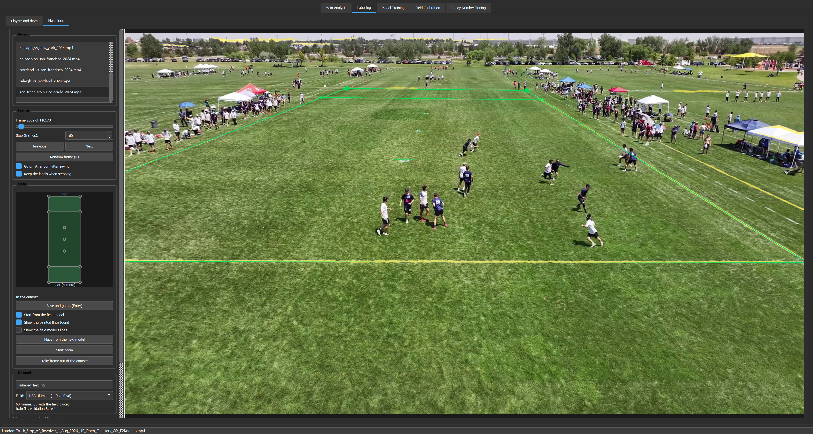

# Ultimate Analysis

A desktop app that analyses Ultimate Frisbee video: it finds the players and the disc,
follows them, reads jersey numbers, tells who has the disc, and shows the play from above.
Built with PyQt5 and YOLO; runs at about 30 frames per second on an RTX 5060 Ti.


## What it does

- **Detection and tracking** of players and the disc, with a trail per player. Observers
  in orange are left out.
- **Possession**: the player holding the disc is marked in gold.
- **Jersey numbers**, read in the background and collected per player over time.
- **Field**: the field's outline and lines, and a top-down view, either from a
  calibration set by hand or from where the field model sees the field.
- **Labelling**: mark players, discs, and the field on frames of your own videos,
  starting from what the models already find. Also from a phone, for discs.
- **Training**: train detection and segmentation models on those labels from the app,
  with live plots.

| Labelling players and discs | Labelling the field |
| --- | --- |
|  |  |

More screenshots: [training](docs/gui_example_model_training.png),
[field calibration](docs/gui_example_homography.png),
[jersey number tuning](docs/gui_example_ocr_tuning.png).

## Quick start

Needs Python 3.12 and, in practice, an NVIDIA GPU.

```bash
git clone https://github.com/sylejroy/ultimate-analysis.git
cd ultimate-analysis
python -m venv .venv
.venv\Scripts\activate  # Windows
python -m pip install -r requirements.txt
python main.py
```

1. Put videos in `data/raw/videos` (or fetch some: `python scripts/download_videos.py`).
2. Pick a video in the Main Analysis tab and press play.
3. Switch detection, tracking, jersey numbers, the field, and the top-down view on and
   off as you like.

Models are not part of the repository. Train your own in the Model Training tab, or
place weights under `data/models/`; see [docs/DATA.md](docs/DATA.md).

## How a frame is analysed

1. **Detection**: one YOLO26s model for players, one for discs.
2. **Camera motion**: how the picture moved since the last frame, so a pan does not look
   like every player jumping. Close-ups and title cards of an edited game are noticed
   and left out.
3. **Tracking**: stable IDs per player, kept within their team.
4. **Possession**: whose box holds the disc, confirmed over several frames.
5. **Jersey numbers**: a few players are read per frame; the readings add up per player.
6. **Field**: every fifth frame, the field's outline and lines.
7. **Drawing**: the camera view with overlays, and the top-down view.

Every stage can be switched off. Settings are in `configs/default.yaml`.

## Find out more

| | |
| --- | --- |
| [docs/LABELLING.md](docs/LABELLING.md) | Labelling players, discs, and the field; labelling from a phone |
| [docs/DATA.md](docs/DATA.md) | Where models and datasets live, and what each dataset is |
| [docs/MEASUREMENTS.md](docs/MEASUREMENTS.md) | Accuracy and speed of every model and stage, and what was tried |
| [docs/DEVELOPMENT_GUIDELINES.md](docs/DEVELOPMENT_GUIDELINES.md) | Code layout, conventions, tests, benchmark scripts |

Handy scripts: `scripts/render_demo.py` renders a stretch of a game as the app shows it,
`scripts/export_tensorrt.py` builds the engines that make the models about three times
faster, and the `scripts/benchmark_*.py` scripts produce the numbers in the measurements.

## Development

```bash
python -m pip install -r requirements-dev.txt
python -m ruff check src tests scripts
python -m ruff format --check src tests scripts
python -m unittest discover -s tests
```

The tests use synthetic frames and mocked models, so they need no videos, weights, or GPU.

## License

Copyright (c) 2025-2026 Sylvain Roy.

Ultimate Analysis is licensed under the
[PolyForm Noncommercial License 1.0.0](LICENSE). You may use, change, and share it for
noncommercial purposes: personal use, study, research, and use by clubs, schools, and
other noncommercial organisations.

**Commercial use needs my written permission beforehand.** That includes selling the
software or a service built on it, and using it in the course of paid work. To ask, open
an issue on the [repository](https://github.com/sylejroy/ultimate-analysis).

The licence covers the code of this repository. The libraries it runs on keep their own
licences, which bind whoever installs and uses them: among others Ultralytics (AGPL-3.0,
with a commercial licence sold by Ultralytics) and PyQt5 (GPL v3, with a commercial
licence sold by Riverbank). Versions of this repository published before October 2026
were offered under the GNU General Public License v3.0 and remain so.
