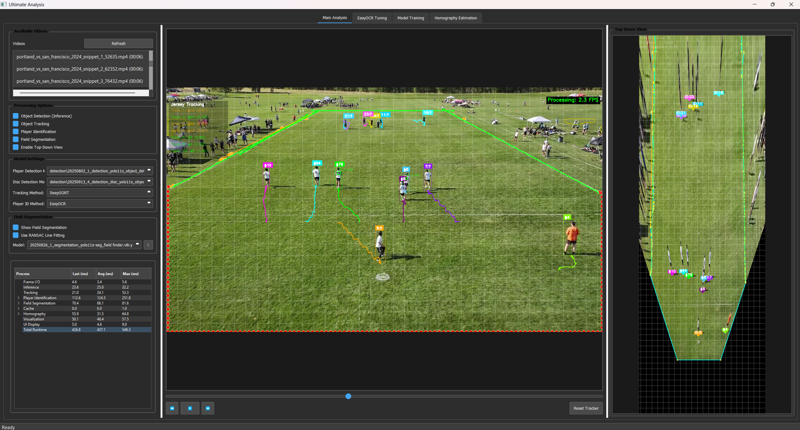
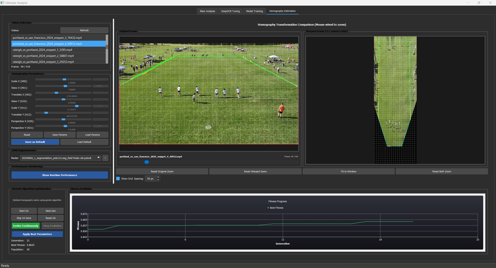

# Ultimate Analysis

A PyQt5-based video analysis application for Ultimate Frisbee, featuring real-time computer vision using YOLO models, DeepSORT tracking, and OCR-based player identification.



## Implemented Features

- **Real-time Object Detection**: Detects players and discs in video frames using YOLO models. Supports separate models for player and disc detection.
- **Multi-object Tracking**: Maintains consistent player and disc identities across frames using DeepSORT. Visualizes track histories and foot-level positions.
- **Player Identification (OCR)**: Recognizes jersey numbers using EasyOCR, with a dedicated tab for parameter tuning and crop extraction.
- **Field Segmentation**: Detects field boundaries and regions using YOLO-based segmentation models. Visualizes overlays and supports perspective correction.
- **Homography Estimation**: Interactive tab for perspective correction, field mapping, and overlaying segmentation results. Includes parameter sliders, real-time preview, and genetic algorithm optimization.
- **Model Training Interface**: GUI for training custom YOLO detection and segmentation models. Supports dataset selection, parameter tuning, live progress monitoring, and baseline comparison.
- **Performance Monitoring**: Built-in timing and memory analysis widgets for runtime profiling.

## Screenshots

### Main Analysis Interface

*Real-time video analysis with object detection, tracking, and player ID*

### Homography Estimation Interface

*Interactive perspective correction and field mapping*

### Model Training Interface

*Train custom YOLO models with live progress graphs and baseline comparison*

### OCR Tuning Interface

*Fine-tune OCR parameters for jersey number recognition*

## Quick Start

### Requirements
- Python 3.8+
- CUDA-compatible GPU (recommended)
- 8GB RAM minimum

### Installation

1. **Clone and setup**:
   ```bash
   git clone <repository-url>
   cd ultimate-analysis
   python -m venv .venv
   .venv\Scripts\activate  # Windows
   pip install -r requirements.txt
   ```

2. **Run the application**:
   ```bash
   python main.py
   ```

### Basic Usage

1. Load a video file through the Main Analysis tab
2. Select YOLO models for player/disc detection and field segmentation
3. Click play to start real-time analysis
4. Use the Homography tab for perspective correction and field mapping
5. Access Model Training and OCR Tuning tabs for advanced features

## Configuration

Configuration files are in `configs/`:
- `default.yaml` - Base settings
- `easyocr_params.yaml` - EasyOCR parameters and preprocessing settings
- `training.yaml` - Model training parameters
- `homography_params.yaml` - Saved homography transformations

## Development

Project follows the KISS principle (max 500 lines per file). Key directories:

- `src/ultimate_analysis/gui/` - PyQt5 interface and tabs
- `src/ultimate_analysis/processing/` - ML inference, tracking, segmentation
- `src/ultimate_analysis/config/` - YAML configuration management
- `data/models/` - YOLO models (detection, segmentation, pose)

See `docs/DEVELOPMENT_GUIDELINES.md` for coding standards.

## Models

Custom-trained YOLO models:
- **Detection**: Player and disc detection (`yolo11l.pt`, `yolo11s.pt`, etc.)
- **Segmentation**: Field boundary detection (`yolo11l-seg.pt`, etc.)
- **Player ID**: EasyOCR for jersey number recognition

Models are cached for performance and organized by training runs in `data/models/`.

## License

GNU General Public License v3.0 - see LICENSE file for details.

## Notes

- All features listed above are confirmed as implemented in the codebase.
- Upcoming features and experimental ideas are tracked in project documentation, not in this README.